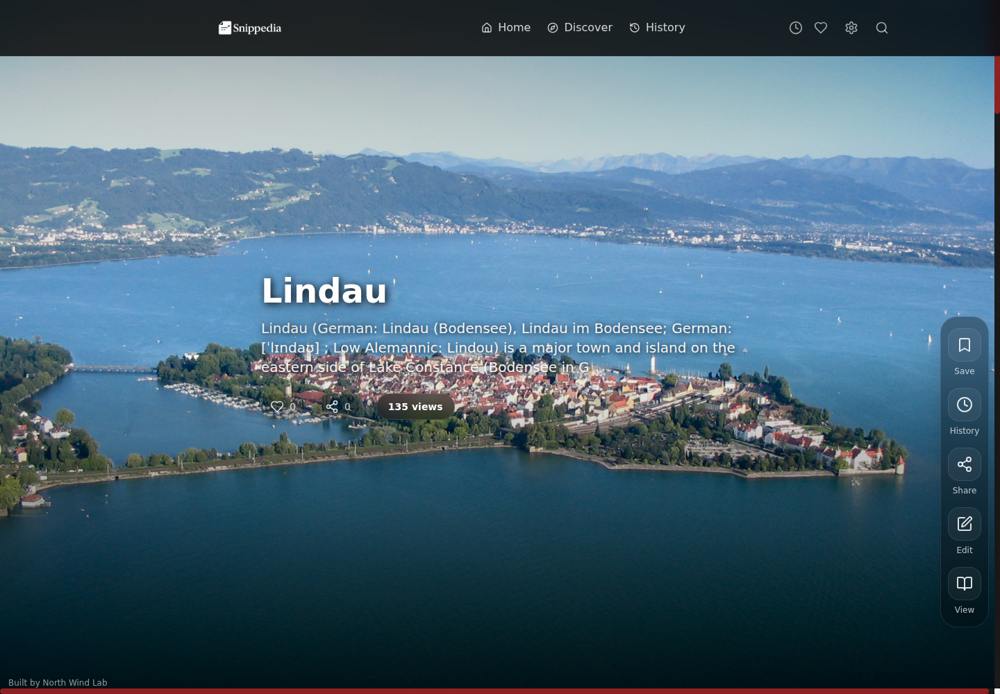
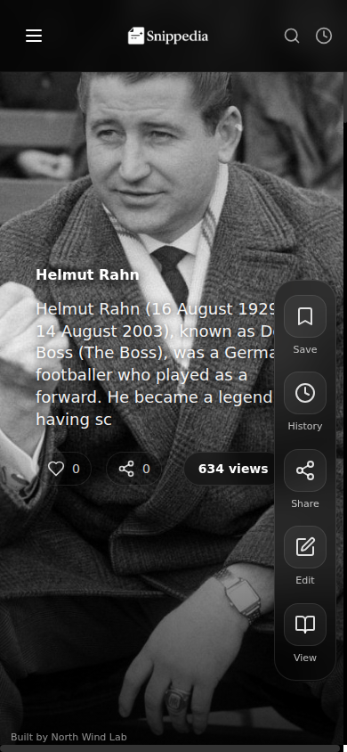

# Snippedia

<p align="center">
  
</p>

<p align="center">
  <strong>Short-form knowledge discovery powered by Wikipedia.</strong>
</p>

<p align="center">
  <a href="https://snippedia.app/">Live Demo</a> ·
  <a href="#features">Features</a> ·
  <a href="#getting-started">Getting Started</a> ·
  <a href="#roadmap">Roadmap</a> ·
  <a href="docs/case-study.md">Case Study</a>
</p>

<p align="center">
  
  
  
  
  
</p>

## Live Demo

Try Snippedia here: https://snippedia.app/

## Why Snippedia

Traditional encyclopedia pages are powerful, but they can feel dense when someone only wants to explore, sample, and follow curiosity. Snippedia reimagines that flow as a visual, swipeable feed where each article becomes a lightweight entry point into deeper learning.

The product goal is to make credible educational content feel fast, approachable, and habit-forming without turning it into noise.

## Features

- Wikipedia-powered article search and discovery
- Full-screen swipeable article feed
- Trending and category-based exploration
- Smart search ranking for ambiguous terms
- Favorites, reading history, and reading stats
- Progressive Web App support
- Offline-aware article caching
- Responsive interface for desktop and mobile
- Share previews for article links

## Product Highlights

- Mobile-first reading experience inspired by modern discovery feeds
- Resilient Wikipedia/Wikimedia API integration with fallbacks for missing metadata
- Local-first personalization using history, favorites, and reading activity
- Open source setup with MIT license, security policy, contribution guide, and CI

## Tech Stack

- React
- TypeScript
- Vite
- Tailwind CSS
- shadcn/ui
- TanStack Query
- Framer Motion
- Express
- MySQL
- Wikipedia and Wikimedia APIs

## Screenshots

<p align="center">
  
</p>

<p align="center">
  
</p>

## Getting Started

Install dependencies:

```sh
npm install
```

Start the development server:

```sh
npm run dev
```

Build for production:

```sh
npm run build
```

Preview the production build:

```sh
npm run preview
```

## Optional API Server

The repository includes a small Express/MySQL API under `server/`. Configure it with environment variables before running it:

```sh
cp server/.env.example server/.env
# edit server/.env with local database credentials
```

Database credentials should never be committed to the repository.

## Project Structure

- `src/components`: reusable UI and product components
- `src/pages`: route-level pages
- `src/hooks`: local state and app behavior hooks
- `src/services`: API integrations, caching, and article transformation logic
- `server`: optional Express/MySQL API
- `share-server`: share preview server for social metadata
- `public`: static assets and PWA files

## Roadmap

- Add real screenshots and a product walkthrough GIF
- Add tests for search ranking and article normalization
- Improve code splitting for smaller production bundles
- Expand accessibility checks across feed navigation and dialogs
- Add richer recommendation signals for article discovery

## Contributing

Contributions are welcome. Please read [CONTRIBUTING.md](CONTRIBUTING.md) before opening a pull request. Please also read [CODE_OF_CONDUCT.md](CODE_OF_CONDUCT.md).

## Security

If you find a vulnerability or accidentally discover sensitive data, please follow [SECURITY.md](SECURITY.md).

## License

Snippedia is released under the [MIT License](LICENSE).
